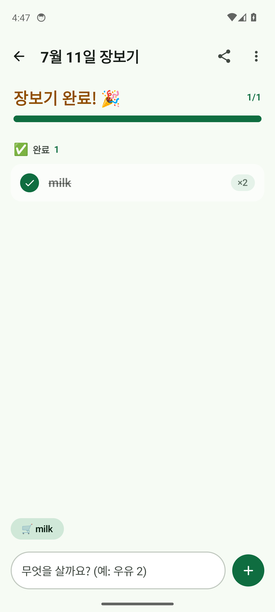

# 🛒 장보기

### 장보기 목록을 더 간편하고 기분 좋게

필요한 것을 빠르게 적고, 마트에서는 하나씩 체크하세요.
 목록은 내 기기에 안전하게 저장되고 인터넷 없이도 사용할 수 있어요.

 

  

 

[📲 APK 다운로드](장보기_v1.0.0.apk) · [설치 방법](INSTALL.md) · [디자인 보기](design/DESIGN.md)

 

## ✨ 이런 일을 도와줘요

| 📝 빠른 기록 | 🧺 똑똑한 정리 |
|:--|:--|
| 살 물건과 수량을 바로 입력해요 | 항목을 카테고리별로 자동 분류해요 |
| 자주 사는 항목을 추천받아요 | 마트 동선에 맞춰 보기 쉽게 정리해요 |

| ✅ 장보기 체크 | 🌙 편안한 사용 |
|:--|:--|
| 담은 물건을 체크하고 진행 상황을 봐요 | 라이트 모드와 다크 모드를 지원해요 |
| 목록과 항목을 편집하고 공유해요 | 큰 글씨와 명확한 터치 영역으로 구성했어요 |

## 🚀 바로 사용하기

1. [`장보기_v1.0.0.apk`](장보기_v1.0.0.apk)를 Android 기기에 다운로드하거나 전송합니다.
2. APK 파일을 열고 설치합니다. 처음 설치할 때는 파일을 연 앱에 대해 설치 권한을 허용해야 할 수 있어요.
3. 앱을 열어 새 목록을 만들고 장보기를 시작하세요.

**Android 8.0(API 26) 이상**이 필요합니다. 앱은 완전히 오프라인으로 동작하며 로그인도 필요하지 않습니다.

## 🧑‍💻 개발 환경

Android Studio에서 저장소를 열어 에뮬레이터 또는 연결된 기기에서 실행할 수 있습니다.

| 구성 | 버전 |
|:--|:--|
| Kotlin | 2.0.20 |
| UI | Jetpack Compose · Material 3 |
| 로컬 저장소 | Room 2.6.1 |
| Android SDK | compile/target 34 · min 26 |
| JDK | 17 |

> Gradle Wrapper는 저장소에 포함되어 있지 않습니다. Android Studio가 사용할 Gradle 버전을 설정해야 할 수 있습니다.

## 📚 더 알아보기

- [설치 및 재빌드 안내](INSTALL.md)
- [화면과 디자인 명세](design/DESIGN.md)
- [앱 구조 및 도메인 계약](CONTRACT.md)
- [개발 진행 및 QA 기록](PROGRESS.md)
