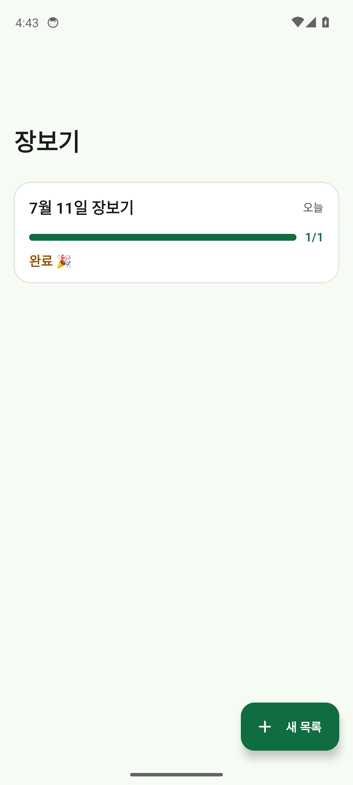

<div align="center">

# 🛒 장보기

### 장바구니부터 살림 계획까지, 한 번에 챙기는 오프라인 장보기 앱

필요한 물건은 빠르게 담고, 마트에서는 보기 좋게 체크하고,
<br />다음 구매 시기와 집에 남은 재고까지 기록해 보세요.

<br />


<br /><br />

<a href="design/qa/qa8_home_v2.png"></a>
&nbsp;&nbsp;&nbsp;
<a href="design/qa/qa11_final.png"></a>

<br /><br />

[📲 최신 APK 받기 · v1.1.0](장보기_v1.1.0.apk) &nbsp;·&nbsp; [설치 안내](INSTALL.md) &nbsp;·&nbsp; [화면·디자인 명세](design/DESIGN.md)

</div>

<br />

## 장보기의 번거로움을 줄이는 작은 기능들

| 빠르게 담기 | 알아서 정리하기 | 마트에서 체크하기 |
|:--|:--|:--|
| `우유 2`, `사과 x3`처럼 입력하면 품목과 수량을 나눠 담아요. | 한국어 품목 키워드로 카테고리를 제안하고, 목록을 보기 좋게 묶어요. | 체크할 때마다 진행 상황이 바뀌고, 완료한 항목은 아래에서 모아봐요. |
| 자주 담는 품목은 최근 기록을 바탕으로 추천해요. | 같은 품목을 다시 담으면 수량을 합쳐 관리해요. | 실수로 지우거나 완료 항목을 비워도 바로 실행 취소할 수 있어요. |

## 🗓️ 장보기에서 살림 계획까지

**살림 계획** 화면에서 자주 사는 품목의 구매 정보를 이어서 관리할 수 있어요.

- 언제 살지, 어느 매장에서 살지 기록
- 꼭 사야 하는 날짜와 미리 쟁일 달 저장
- 집에 남은 재고 수량을 빠르게 조정
- 가까운 기한, 보유 재고, 비축 계획 품목을 한눈에 확인

장보기 목록의 품목을 편집해 계획을 정리하면, 다음에 다시 추가할 때 구매 정보가 이어집니다. 구매 계획은 목록을 정리한 뒤에도 기기에 보관되어 살림 계획 화면에서 계속 관리할 수 있어요.

## 🚀 1분 만에 시작하기

1. [최신 APK](장보기_v1.1.0.apk)를 Android 기기에 다운로드하거나 전송합니다.
2. APK 파일을 열어 설치합니다. 처음 설치할 때는 파일을 연 앱에 대해 설치 권한을 허용해야 할 수 있어요.
3. 앱에서 **새 목록**을 만들고, 아래 입력창에 살 물건을 적습니다.
4. 마트에서 항목을 눌러 체크하고, 필요하면 목록을 공유하거나 살림 계획을 기록합니다.

**Android 8.0(API 26) 이상**에서 사용할 수 있습니다. 앱은 인터넷 연결과 계정 없이 동작하고, 데이터는 기기 안에 저장됩니다.

### 입력 예시

```text
우유 2       → 우유 2개
사과 x3      → 사과 3개
세제         → 세제 1개
```

품목 이름 뒤에 수량을 적으면 자동으로 분리됩니다. 품목 이름을 누르면 수량과 카테고리, 구매 계획을 수정할 수 있어요.

## ✨ 사용 흐름

1. **목록 만들기** — 장보기 목적에 맞춰 목록을 만들고 이름을 바꿔 관리합니다.
2. **품목 담기** — 품목을 입력하거나 추천 항목을 탭해 추가합니다. 카테고리는 자동 제안되며 직접 수정할 수도 있어요.
3. **장보기하기** — 미완료 품목은 카테고리별로 정리됩니다. 품목을 탭하면 구매 완료로 표시되고 진행률에 반영됩니다.
4. **공유·정리하기** — 목록을 텍스트로 공유하고, 완료한 품목을 비우거나 삭제할 수 있습니다. 삭제와 비우기는 실행 취소를 지원합니다.
5. **다음 구매 준비하기** — 품목을 편집해 구매 날짜, 매장, 기한, 비축 월, 현재 재고를 저장하고 **살림 계획**에서 모아봅니다.

## 🧩 화면과 기능

| 화면 | 할 수 있는 일 |
|:--|:--|
| 홈 | 목록 생성·이름 변경·삭제, 구매 진행률 확인, 살림 계획 진입 |
| 목록 상세 | 빠른 추가, 수량 입력, 카테고리별 보기, 완료 체크, 편집·삭제, 실행 취소, 텍스트 공유 |
| 살림 계획 | 품목별 구매 정보와 재고 관리, 7일 내 기한·재고·비축 계획 요약 |

**11개 카테고리**를 지원합니다: 채소, 과일, 정육·계란, 수산, 유제품, 냉동·간편식, 과자·간식, 음료, 조미료·소스, 생활용품, 기타.

## 🛠️ 기술 구성

| 영역 | 사용 기술 |
|:--|:--|
| 언어·UI | Kotlin 2.0.20 · Jetpack Compose · Material 3 |
| 앱 구조 | 화면 / ViewModel / 도메인 / 데이터 계층 |
| 로컬 데이터 | Room 2.6.1 · Kotlin Flow |
| 빌드 | Gradle Wrapper · Android Gradle Plugin · JDK 17 |
| 지원 범위 | minSdk 26 · compileSdk / targetSdk 34 |

데이터 흐름은 `Compose UI → ViewModel → Repository → Room`으로 나뉩니다. 품목 수량 파싱, 자동 분류, 카테고리 정렬, 공유 문구 생성은 UI와 분리된 도메인 코드에서 처리합니다.

### 개발 환경에서 실행하기

1. 저장소를 Android Studio에서 엽니다.
2. JDK 17과 Android SDK 34를 설정하고 Gradle 동기화를 기다립니다.
3. 에뮬레이터 또는 Android 기기를 선택한 뒤 `app` 구성을 실행합니다.

Windows PowerShell에서 명령줄로 빌드할 수도 있습니다.

```powershell
.\gradlew.bat :app:assembleDebug
```

디버그 APK는 `app/build/outputs/apk/debug/app-debug.apk`에 생성됩니다. 도메인 단위 테스트는 다음 명령으로 실행할 수 있어요.

```powershell
.\gradlew.bat :app:testDebugUnitTest
```

## 🔍 품질 확인

- 수량 입력 파싱, 품목 자동 분류, 카테고리 정렬, 공유 텍스트 생성을 단위 테스트로 다룹니다.
- Pixel 7 / Android 14(API 34) 에뮬레이터에서 목록 생성부터 품목 추가·체크, 추천, 다크 모드까지 주요 흐름을 확인했습니다.
- 라이트·다크 테마와 키보드가 열린 상태의 빠른 입력을 고려해 화면을 구성했습니다.

## 📚 더 보기

- [설치 및 재빌드 안내](INSTALL.md)
- [화면과 디자인 명세](design/DESIGN.md)
- [앱 구조 및 도메인 계약](CONTRACT.md)
- [개발 진행 기록](PROGRESS.md)
